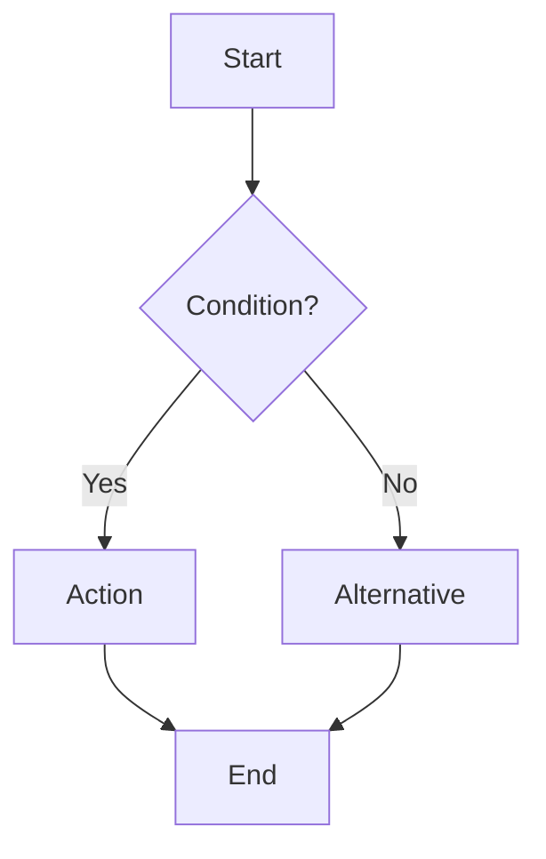

# LaTeX Experiment - Live Editor

Two powerful editors for experimenting with LaTeX, TikZ, and mathematical visualizations.

## Files

- **`index.html`** - Simple LaTeX editor with basic drawing tools
- **`advanced.html`** - Professional editor with Monaco, TikZ visual editor, and JSXGraph

## Advanced Editor Features (advanced.html)

### 1. Monaco Editor
- **Professional code editor** (same as VS Code)
- **LaTeX syntax highlighting**
- **Auto-completion** and IntelliSense
- **Line numbers** and code folding
- **Real-time preview** with 500ms debounce
- **Export to .tex** or PDF

### 2. TikZ Visual Editor (WYSIWYG)
- **Draw visually** and generate TikZ code
- **Tools**: Line, Arrow, Rectangle, Circle, Text, Node, Curve
- **Properties**: Stroke color, width, fill color
- **Grid system** for precise placement
- **Auto-generate TikZ code** from drawings
- **Copy/paste** TikZ into LaTeX documents
- Perfect for: Circuit diagrams, force diagrams, geometric figures

### 3. JSXGraph Integration
- **Interactive graph plotter** with pan/zoom
- **Function plotting**: Plot f(x) = expressions
- **Points and geometry**: Add labeled points
- **Dynamic updates**: Modify and clear graphs
- **Export graphs** as images or TikZ
- Supports: sin, cos, tan, exp, log, polynomials

### 4. Export System
- **Export PDF**: Client-side PDF generation with jsPDF
- **Export LaTeX**: Download complete .tex files
- **Copy Code**: One-click clipboard copy
- **Full document structure** with packages and formatting

## Basic Editor Features (index.html)

### LaTeX Editor
- **Split View**: Editor on the left, live preview on the right
- **Auto Render**: Updates preview as you type (300ms debounce)
- **Manual Mode**: Toggle to manual rendering if needed
- **KaTeX**: Fast, accurate LaTeX rendering
- **Syntax Support**:
  - Display math: `$$...$$` or `\[...\]`
  - Inline math: `$...$` or `\(...\)`
  - Full KaTeX syntax support

### Drawing Canvas
- **Freehand Drawing**: Draw diagrams, sketches, and illustrations
- **Color Picker**: Choose any color for your drawings
- **Brush Sizes**: Adjustable line thickness (1-20px)
- **Eraser**: Toggle between pen and eraser mode
- **Export**: Save drawings as PNG files
- Perfect for: Force diagrams, circuit diagrams, geometry problems, freeform sketches

### Function Graphing
- **Multiple Functions**: Plot multiple functions simultaneously
- **Mathematical Functions**: Support for sin, cos, tan, sqrt, log, exp, abs
- **Custom Range**: Adjustable x-axis range
- **Auto-scaling**: Automatic y-axis scaling
- **Export**: Save graphs as PNG files
- Perfect for: Plotting equations, comparing functions, calculus visualization

### Diagrams (Mermaid)
- **Flowcharts**: Create algorithm and process flows
- **Sequence Diagrams**: Visualize interactions and protocols
- **State Diagrams**: Model state machines
- **Class Diagrams**: UML diagrams for CS/software design
- **Git Graphs**: Version control visualization
- Perfect for: CS algorithms, system design, physics processes

## Quick Start

### Advanced Editor (Recommended)
```bash
open advanced.html
```

### Basic Editor
```bash
open index.html
```

Or use a local server:
```bash
python3 -m http.server 8000
# Visit http://localhost:8000/advanced.html
```

## Workflow Examples

### Physics Problem with Diagram
1. Open **advanced.html**
2. In **LaTeX Editor** tab: Write equations and problem setup
3. Switch to **TikZ Visual** tab: Draw force diagram or circuit
4. Click **Generate TikZ** to get code
5. Copy TikZ code back into LaTeX editor
6. Click **Export LaTeX** for complete .tex file

### Function Analysis
1. Open **JSXGraph** tab
2. Plot functions: `f(x) = x^2 - 4*x + 3`
3. Add critical points: `(2, -1)`
4. Observe intersections and behavior visually
5. Write analysis in LaTeX editor

### Circuit or Diagram Design
1. Use **TikZ Visual** to draw components
2. Use arrows for current flow
3. Add text labels for values
4. Generate clean TikZ code
5. Integrate into homework or lab report

## Examples

### LaTeX
The editor comes preloaded with physics equations:
- Schrödinger equation
- Maxwell's equations
- Quadratic formula
- Integrals and matrices

### Graphing
Plot any mathematical function:
```
y = x^2
y = sin(x)
y = 2*cos(x)
y = exp(-x^2)
y = 1/(1 + x^2)
```

### Diagrams
Create flowcharts, sequence diagrams, and more:


## Use Cases

### Physics
- Draw force diagrams and free body diagrams
- Plot wave functions and potentials
- Visualize electromagnetic fields
- Graph energy levels and spectra

### Mathematics
- Sketch geometric proofs
- Plot functions and their derivatives
- Draw coordinate systems and transformations
- Create flowcharts for algorithms

### Computer Science
- Algorithm flowcharts
- State machine diagrams
- Network topology diagrams
- System architecture diagrams
- Data structure visualizations

## Technology Stack

### Advanced Editor
- **Monaco Editor**: Professional code editor (VS Code engine)
- **KaTeX**: Fast LaTeX math rendering
- **JSXGraph**: Interactive geometry and function plotting
- **jsPDF**: Client-side PDF generation
- **Canvas API**: TikZ visual editor with shape tools

### Basic Editor
- **Textarea**: Simple text input
- **KaTeX**: Math rendering
- **Canvas API**: Freehand drawing
- **Mermaid**: Flowcharts and diagrams

## Comparison

| Feature | Basic (index.html) | Advanced (advanced.html) |
|---------|-------------------|-------------------------|
| Code Editor | Basic textarea | Monaco (VS Code) |
| LaTeX Syntax | ✗ | ✓ (highlighting) |
| Drawing | Freehand only | Shapes + TikZ export |
| Graphing | Basic plotter | JSXGraph (interactive) |
| TikZ Support | ✗ | ✓ (WYSIWYG editor) |
| Export | PNG only | PDF + .tex + copy |
| Diagrams | Mermaid | TikZ visual |
| Best For | Quick experiments | Professional documents |

## Customization Ideas

You can experiment with:
- Different rendering libraries (MathJax vs KaTeX)
- 3D graphing (Three.js, Plot.ly)
- Interactive simulations
- Animation support
- Export to LaTeX document
- Collaborative editing
- Save/load functionality
- More diagram types (mind maps, Gantt charts)
- Physics-specific diagram tools (circuit builder, optics ray tracing)
